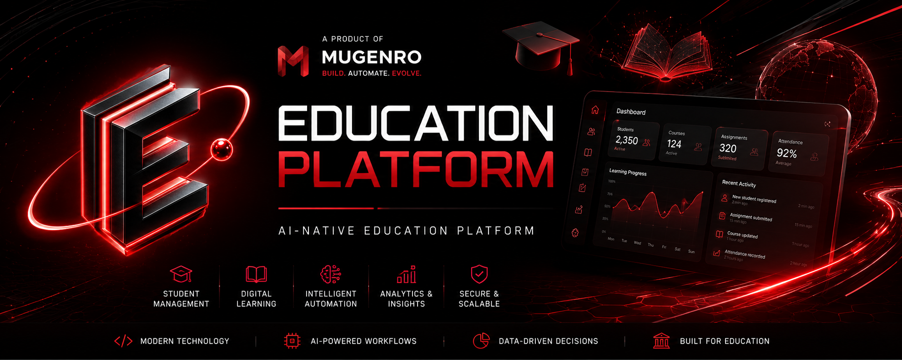

# Education Platform

  

  

  <strong>AI-powered education platform for modern learning, student management, and intelligent educational workflows.</strong>

  <strong>Version 1.0.0</strong> · Stable Release · MUGENRO Ecosystem

---

## About

**Education Platform** is an AI-native education technology platform developed by **MUGENRO**.

The platform is designed to modernize educational workflows by combining modern web technologies, intelligent automation, student management, learning tools, and AI-powered systems.

Education Platform is built for educational organizations, learning centers, educators, and students who need modern digital infrastructure for managing and improving educational processes.

---

## Vision

Education should not be limited to traditional learning management systems.

Education Platform is being developed toward an intelligent educational environment where software can understand educational processes, automate repetitive tasks, assist students and educators, and continuously improve the learning experience.

> **Learn. Automate. Evolve.**

---

## Core Areas

### Student Management

Tools and infrastructure for organizing student information, educational processes, and academic workflows.

### Learning

Modern interfaces and systems designed to support digital learning and educational content.

### Intelligent Automation

Automation of repetitive educational workflows to reduce administrative workload and improve operational efficiency.

### AI Integration

AI-powered capabilities designed to assist users, analyze educational information, and support educational decision-making.

### Educational Analytics

Infrastructure for working with educational data and generating useful insights for students, educators, and organizations.

---

## Features

Education Platform provides the foundation for:

- Student management
- Educational workflows
- Learning management
- Course organization
- Educational data management
- Intelligent automation
- AI-assisted workflows
- Educational analytics
- Modern web-based interfaces
- Scalable platform architecture

The platform is designed to evolve as new intelligent capabilities are introduced.

---

## Technology

Education Platform currently uses a modern web technology stack:

- Next.js
- React
- TypeScript
- JavaScript
- Node.js
- CSS

The architecture and technology stack may evolve as the product develops.

---

## Architecture

The platform follows a modular architecture designed for continuous development and future AI integration.

The architecture is intended to support:

- Modular product development
- Intelligent automation
- AI-powered services
- Scalable infrastructure
- API integrations
- Multi-user environments
- Educational analytics
- Continuous product evolution

---

## Repository Structure

EducationPlatform

├── app/
│   └── Application routes and pages
│
├── data/
│   └── Application and educational data
│
├── lib/
│   └── Shared application logic and utilities
│
├── public/
│   └── Static assets and product branding
│       └── branding/
│           ├── education-platform-banner.png
│           └── education-platform-logo.png
│
├── .gitignore
├── AGENTS.md
├── CLAUDE.md
├── README.md
├── eslint.config.mjs
├── next.config.ts
├── package.json
├── package-lock.json
├── postcss.config.mjs
├── test.json
└── tsconfig.json

---

## Current Status

**Version:** `1.0.0`

**Status:** Stable Release

Education Platform has reached its first stable release.

Version `1.0.0` represents the transition from the initial development stage into a stable product intended for real-world use and commercial deployment.

The product is currently being introduced to early customers and educational organizations.

---

## Release Philosophy

Version `1.0.0` marks the first stable milestone of Education Platform.

Future development will focus on:

- Product improvements
- Customer feedback
- New educational workflows
- AI capabilities
- Intelligent automation
- Platform scalability
- Reliability
- Security
- Integrations

Future releases will expand the platform while maintaining the stability of the core product.

---

## Roadmap

### Phase 1 — Foundation

- [x] Initial web application
- [x] Next.js project architecture
- [x] Core project structure
- [x] Initial deployment
- [x] Product UI system
- [x] Application architecture
- [x] Stable `v1.0.0` release

### Phase 2 — Education Core

- [ ] Advanced student management
- [ ] User accounts
- [ ] Educational dashboards
- [ ] Learning workflows
- [ ] Course management
- [ ] Educational data management

### Phase 3 — AI Intelligence

- [ ] AI-powered educational assistant
- [ ] Intelligent recommendations
- [ ] Automated educational workflows
- [ ] AI-assisted analytics
- [ ] Personalized learning features

### Phase 4 — Platform

- [ ] Teacher tools
- [ ] Institution management
- [ ] Advanced analytics
- [ ] Automation engine
- [ ] API infrastructure
- [ ] Scalable multi-user architecture
- [ ] External integrations

---

## Product Direction

Education Platform is intended to evolve from a modern educational application into a broader AI-native education platform.

The long-term direction includes:

- Student and educator management
- Digital learning
- Educational content
- Intelligent automation
- AI assistance
- Personalized learning
- Educational analytics
- Institutional management
- Scalable education infrastructure

---

## Development Philosophy

Education Platform follows the AI-native software development principles of MUGENRO.

The product is designed around:

- **Intelligent by design**
- **Modular architecture**
- **Automation-first workflows**
- **Scalable infrastructure**
- **User-focused interfaces**
- **Continuous improvement**
- **AI-assisted development**

Artificial intelligence is intended to become a core part of the platform architecture rather than simply an additional feature.

---

## MUGENRO Ecosystem

Education Platform is the **first stable product representing the MUGENRO ecosystem**.

MUGENRO is an AI-native software company focused on building intelligent products, automation systems, developer tools, and next-generation software infrastructure.

MUGENRO follows a product maturity principle:

> **Develop independently. Stabilize. Release. Integrate into the ecosystem.**

Products are initially developed independently under their own repositories and remain outside the official MUGENRO ecosystem during active development.

After reaching a stable `v1.0.0` release, a product can become an official representative of the MUGENRO ecosystem.

### Official Ecosystem Products

- **Education Platform** — AI-powered education technology platform

### Products in Independent Development

- **ShortsFactory** — short-form video automation platform
- **TraderOS** — intelligent trading software platform

These products remain in their independent development stage until their respective stable `v1.0.0` releases.

After reaching `v1.0.0`, a product may be integrated into the official MUGENRO ecosystem.

This approach allows each product to mature independently before receiving full ecosystem integration.

---

## Product Lifecycle

MUGENRO products follow a structured lifecycle:

**Idea → Development → Testing → Independent Product → Stable v1.0.0 → MUGENRO Ecosystem**

This structure allows MUGENRO to develop products independently while gradually building a unified software ecosystem.

---

## Deployment

The current application is deployed online for demonstration and product use.

### Live Application

https://nexora-ai-omega-lac.vercel.app

> The deployment URL may be updated when the production domain is finalized.

---

## Installation

Clone the repository:

git clone https://github.com/MUGENRO/EducationPlatform.git

cd EducationPlatform

Install dependencies:

npm install

Run the development server:

npm run dev

Then open:

http://localhost:3000

---

## Development

Education Platform is maintained and developed as an official MUGENRO ecosystem product.

Development follows an iterative product-development approach where architecture, functionality, and intelligent capabilities evolve based on technical requirements, customer feedback, and real-world usage.

---

## Contributing

Education Platform is a MUGENRO ecosystem product.

The project is currently maintained by MUGENRO.

External contributions may be considered as the project and ecosystem evolve.

Please review the repository contribution guidelines before submitting changes.

---

## Commercial Use

Education Platform is a commercial software product developed by MUGENRO.

Organizations interested in deploying the platform, discussing customization, integration, licensing, or partnership opportunities can contact MUGENRO.

---

## License

Education Platform is proprietary software developed by MUGENRO.

The source code and associated assets are provided for development, evaluation, and demonstration purposes unless otherwise specified.

Commercial use, redistribution, modification, or deployment may require authorization from MUGENRO.

---

## Contact

For business, partnership, deployment, licensing, or collaboration inquiries:

**MUGENRO**

GitHub:

https://github.com/MUGENRO

---

  <strong>Education Platform</strong>

  Learn. Automate. Evolve.

  © 2026 MUGENRO

